# 📂 Results Folder
This folder stores **outputs generated from experiments** in the MSc dissertation project.

## 📑 Contents
- **Metrics reports** (accuracy, F1-score, AP/AUC, calibration, silhouette values).
- **Plots and visualisations** (confusion matrices, ROC/PR curves, calibration, segmentation clusters, feature importance).
- **Intermediate artefacts** (CSV summaries).

## 📊 Latest Results Summary (Auto-updated)

|   artefact_profile_csv |   artefact_scatter_png |   artefact_val_plot_png |   artefact_val_sweep_csv |   bank_best_f1 |   credit_best_f1 |   model |   retail_best_k_val |   retail_best_silhouette |   retail_test_silhouette |   retail_val_silhouette |   task |   test_AP |   test_ROC_AUC |   test_f1@thr |   test_precision@thr |   test_recall@thr |   tuned_threshold(val) |
|-----------------------:|-----------------------:|------------------------:|-------------------------:|---------------:|-----------------:|--------:|--------------------:|-------------------------:|-------------------------:|------------------------:|-------:|----------:|---------------:|--------------:|---------------------:|------------------:|-----------------------:|
|                    nan |                    nan |                     nan |                      nan |       0.572165 |         0.849315 |     nan |                 nan |                 0.607787 |                      nan |                     nan |    nan |       nan |            nan |           nan |                  nan |               nan |                    nan |

## Probability Calibration (TEST)

**Credit Risk — metrics**

| dataset     | variant         |    brier |   roc_auc |   avg_precision |
|:------------|:----------------|---------:|----------:|----------------:|
| Credit Risk | lr_uncalibrated | 0.155982 |  0.804267 |        0.650842 |
| Credit Risk | lr_sigmoid      | 0.157097 |  0.805486 |        0.657833 |
| Credit Risk | lr_isotonic     | 0.159576 |  0.800914 |        0.655262 |
| Credit Risk | rf_uncalibrated | 0.16343  |  0.794171 |        0.602718 |

**Bank Marketing — metrics**

| dataset        | variant         |     brier |   roc_auc |   avg_precision |
|:---------------|:----------------|----------:|----------:|----------------:|
| Bank Marketing | rf_uncalibrated | 0.0557258 |  0.946554 |        0.670224 |
| Bank Marketing | lr_isotonic     | 0.0582391 |  0.942258 |        0.622466 |
| Bank Marketing | lr_sigmoid      | 0.0605729 |  0.942251 |        0.623669 |
| Bank Marketing | lr_uncalibrated | 0.0605995 |  0.942253 |        0.623388 |

## Plots

**Credit — Confusion Matrix**  

**Bank — Confusion Matrix (best on TRAIN)**  
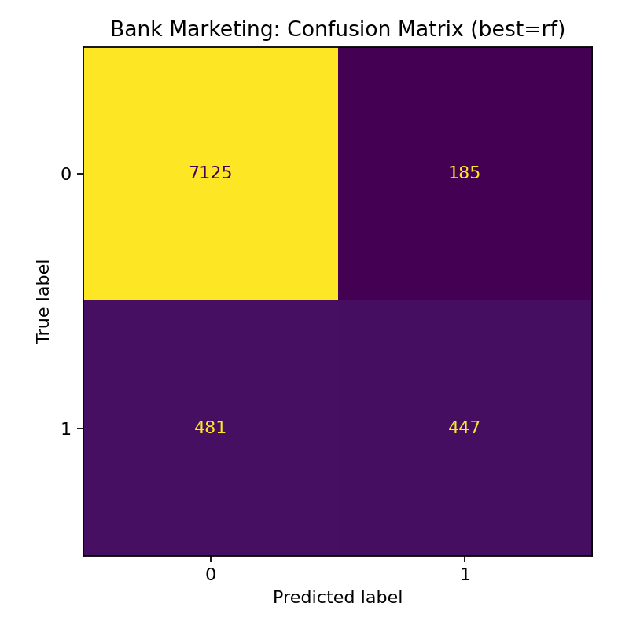

**Credit — ROC Curve**  
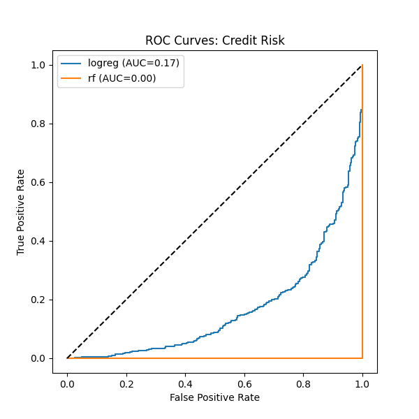

**Bank — ROC Curve (TRAIN)**  
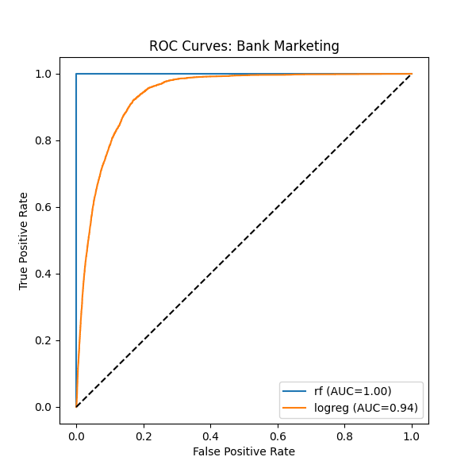

**Bank — PR Curves (TRAIN)**  

**Bank — PR Curve (TEST)**  
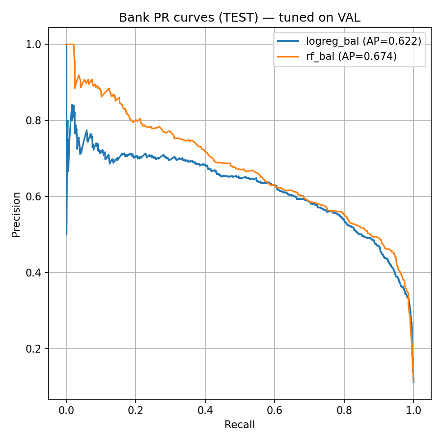

**Bank — ROC Curve (TEST)**  
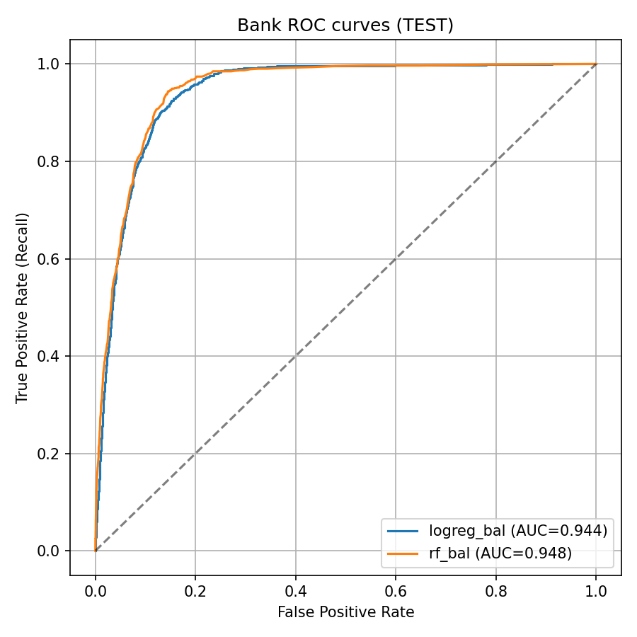

**Bank — Confusion Matrix (TEST, Logistic Regression)**  
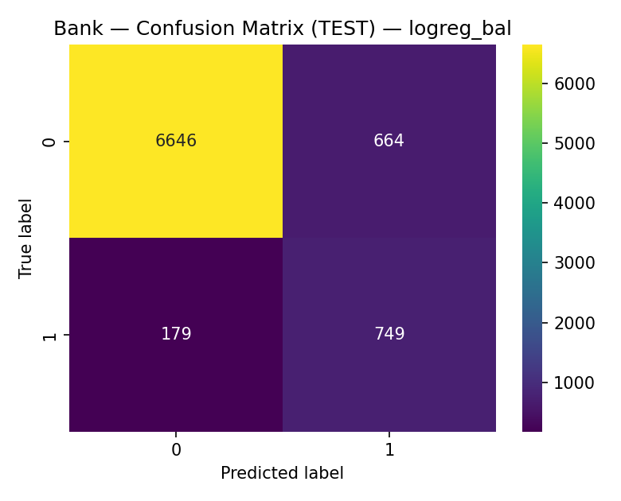

**Bank — Confusion Matrix (TEST, Random Forest)**  

**Credit — Calibration (TEST)**  
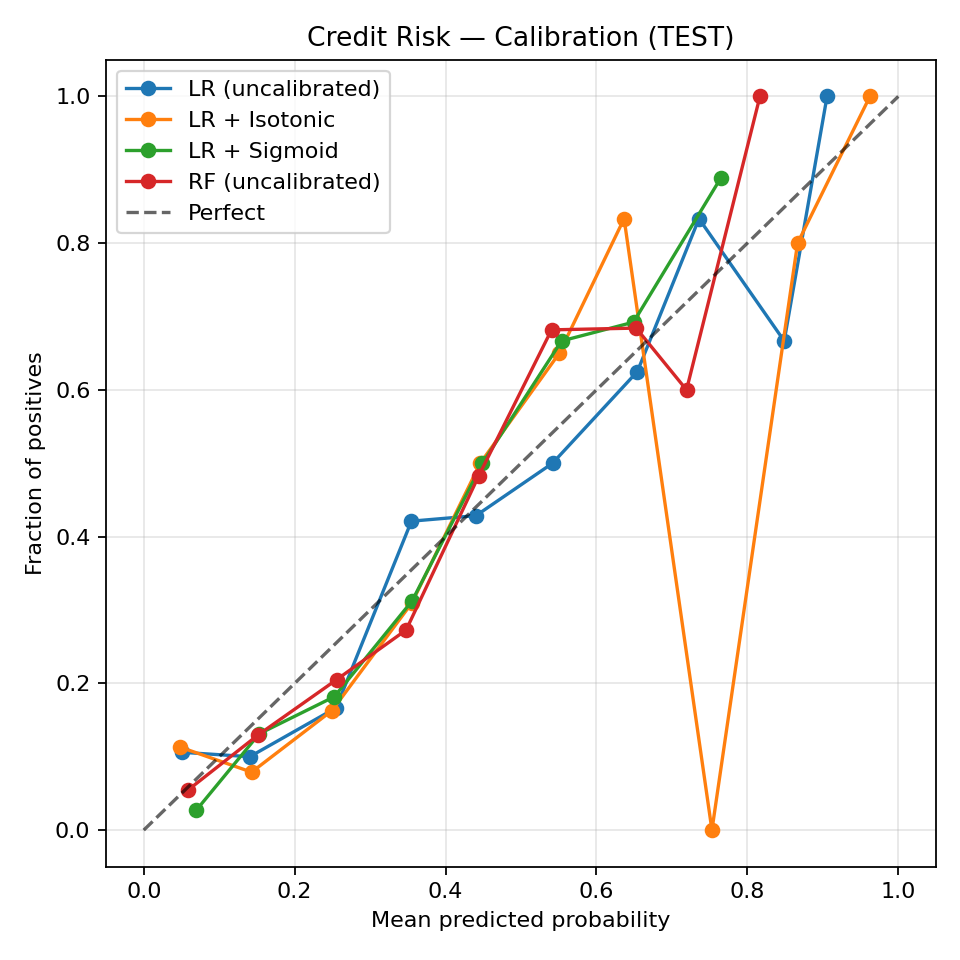

**Bank — Calibration (TEST)**  
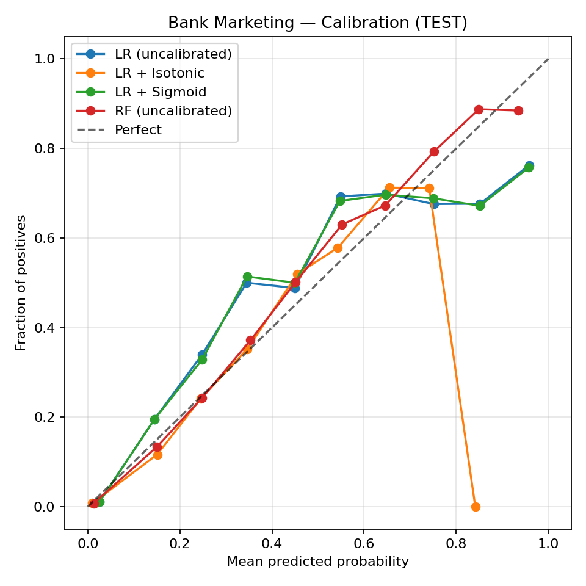

**Credit — Permutation Importance**  
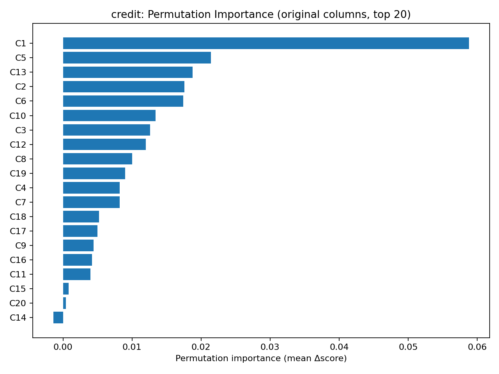  
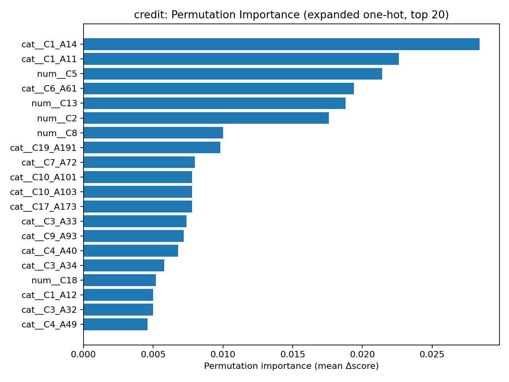

**Bank — Permutation Importance**  
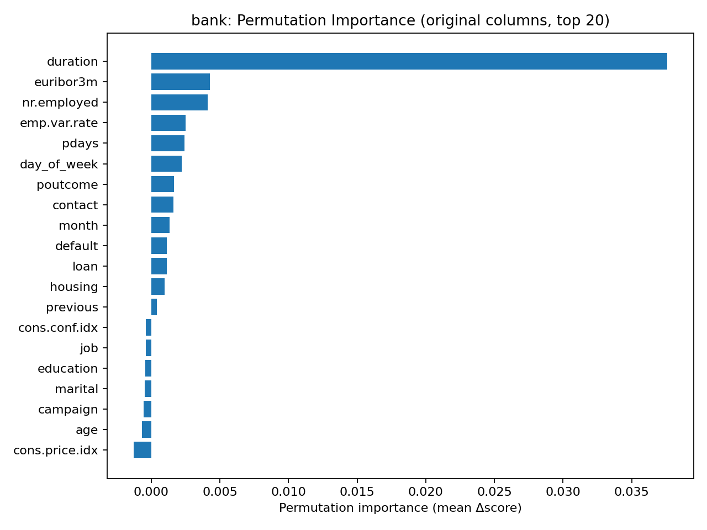  
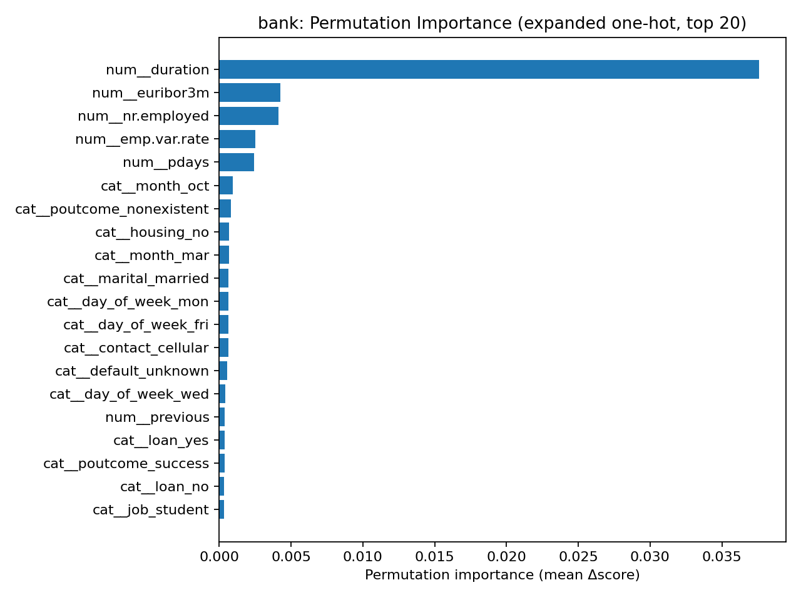

**Retail — Cluster Scatter (from Step 8)**  
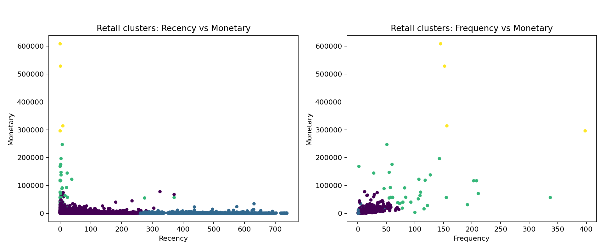

**Retail — Validation Silhouette vs k (Step 14)**  
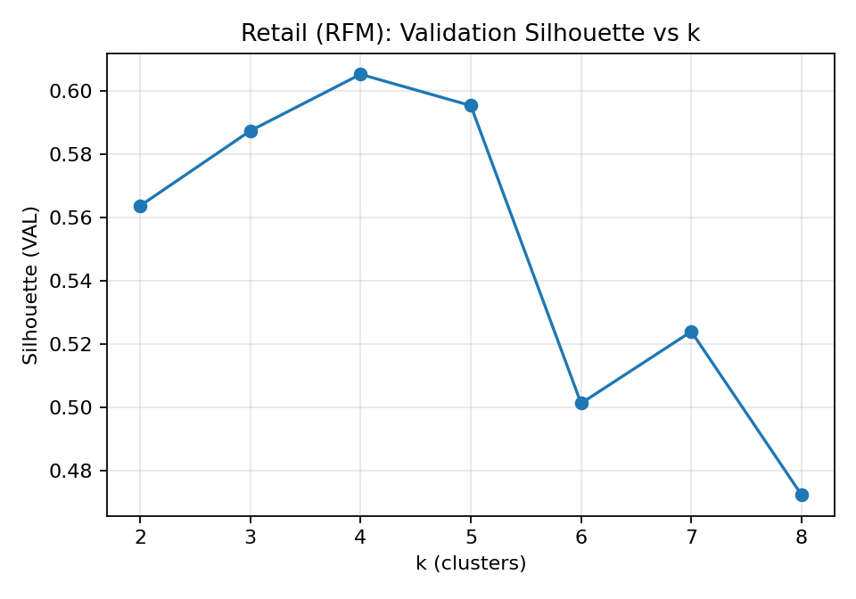

**Retail — Cluster Scatter (final model, Step 14)**  
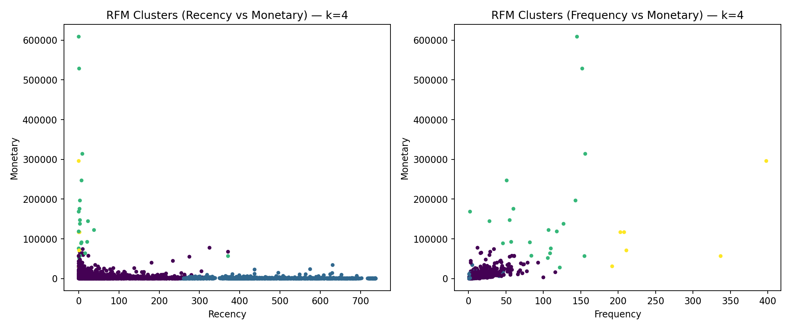

## Key CSV artefacts

- `summary_master.csv`
- `summary.csv`
- `master_results_summary.csv`
- `credit_calibration_metrics.csv`
- `bank_calibration_metrics.csv`
- `bank_threshold_tuning.csv`
- `bank_train_test_eval.csv`
- `silhouette_scores.csv`
- `retail_k_sweep_val.csv`
- `retail_cluster_profile_test.csv`
- `credit_perm_importance_AGG.csv`
- `credit_perm_importance_EXP.csv`
- `bank_perm_importance_AGG.csv`
- `bank_perm_importance_EXP.csv`

_Last updated: 2025-10-02 15:15 UTC_

<!-- AUTO-SUMMARY:BEGIN -->

## 📊 Latest Results Summary (Auto-updated)

### Credit — Error Analysis (misclassified examples)

| C1   |   C2 | C3   | C4   |   C5 | C6   | C7   |   C8 | C9   | C10   |   C11 | C12   |   C13 | C14   | C15   |   C16 | C17   |   C18 | C19   | C20   |   true |   pred |   proba_class2 | error_type     |
|:-----|-----:|:-----|:-----|-----:|:-----|:-----|-----:|:-----|:------|------:|:------|------:|:------|:------|------:|:------|------:|:------|:------|-------:|-------:|---------------:|:---------------|
| A13  |   15 | A32  | A46  | 1905 | A61  | A75  |    4 | A93  | A101  |     4 | A123  |    40 | A143  | A151  |     1 | A174  |     1 | A192  | A201  |      1 |      2 |       0.524413 | False Positive |
| A14  |   27 | A32  | A40  | 2570 | A61  | A73  |    3 | A92  | A101  |     3 | A121  |    21 | A143  | A151  |     1 | A173  |     1 | A191  | A201  |      2 |      1 |       0.412744 | False Negative |
| A11  |   30 | A32  | A41  | 3857 | A61  | A73  |    4 | A91  | A101  |     4 | A122  |    40 | A143  | A152  |     1 | A174  |     1 | A192  | A201  |      1 |      2 |       0.542244 | False Positive |
| A12  |   36 | A32  | A41  | 9398 | A61  | A72  |    1 | A94  | A101  |     4 | A123  |    28 | A143  | A151  |     1 | A174  |     1 | A192  | A201  |      2 |      1 |       0.483553 | False Negative |
| A11  |   24 | A34  | A40  | 1199 | A61  | A75  |    4 | A93  | A101  |     4 | A123  |    60 | A143  | A152  |     2 | A172  |     1 | A191  | A201  |      2 |      1 |       0.371683 | False Negative |

### Plots

**Credit — Confusion Matrix (TEST)**  

**Bank — Rolling retraining vs. fixed model**  

**Bank — Calibration (TEST)**  

**Credit — Calibration (TEST)**  

**Bank — ROC Curve (TEST)**  

**Bank — PR Curve (TEST)**  

**Retail — Cluster Scatter (final)**  

_Last updated: 2025-10-02 16:58 UTC_

<!-- AUTO-SUMMARY:END -->

